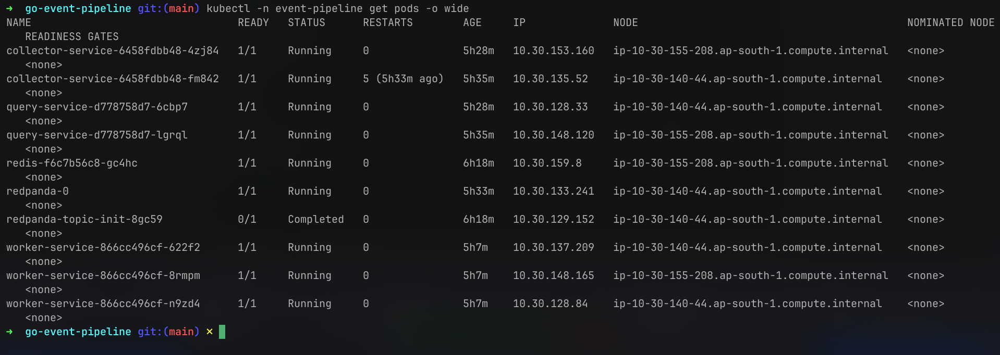
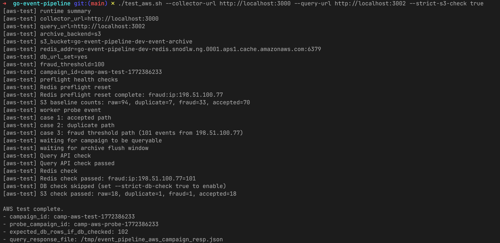
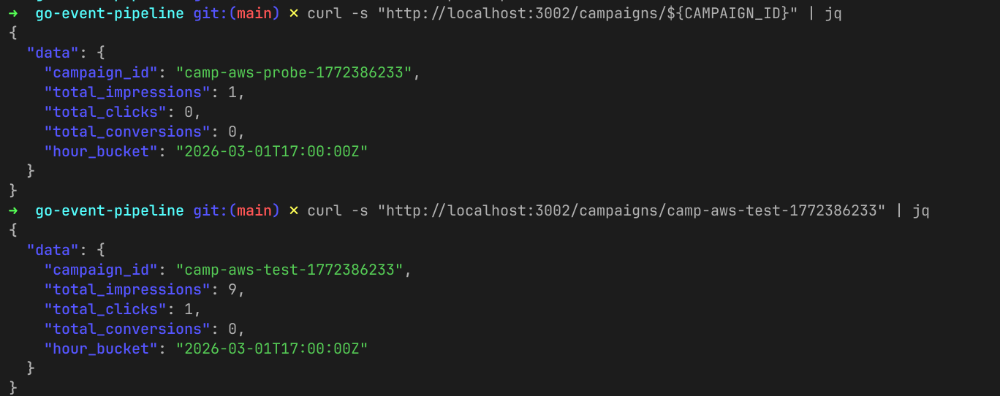
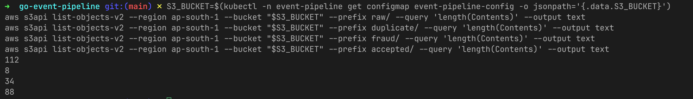
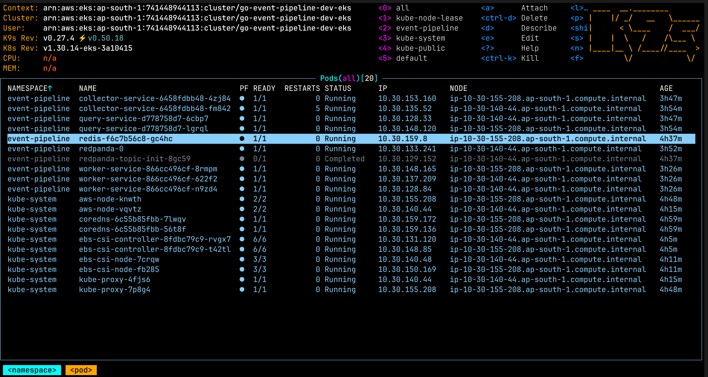

# Go Event Pipeline

Event-driven analytics pipeline in Go with local and AWS deployment paths.

Core runtime flow:

`collector-service` -> Kafka topic `raw-events` -> `worker-service` -> `query-service`

Worker flow per event:
- archive `raw`
- dedupe by `event_id` in Redis
- fraud score by IP window in Redis
- classify `duplicate` / `fraud` / `accepted`
- archive final status
- persist only accepted events to Postgres and upsert campaign aggregates

## Architecture

Services:
- `collector-service`: ingest API (`POST /event`, `POST /events/batch`)
- `worker-service`: async processing, dedupe, fraud scoring, archive, persistence
- `query-service`: read API (`GET /campaigns`, `GET /campaigns/:id`)

Data and infra:
- Kafka: Redpanda
- Redis: dedupe and fraud counters
- Postgres: `raw_events`, `campaign_stats`
- Archive: MinIO locally, S3 on AWS

## Repo layout

- `collector-service/`
- `worker-service/`
- `query-service/`
- `k8s/` Kubernetes base and overlays
- `infra/terraform/` AWS infrastructure
- `test.sh` full local/k8s integration test
- `test_ingest.sh` focused ingest test
- `test_retrieval.sh` focused query test
- `test_aws.sh` AWS-aware end-to-end test

## Quick start (local)

1. Start dependencies:

```bash
docker compose up -d
```

2. Start services in separate terminals:

```bash
cd collector-service && make run
cd worker-service && make run
cd query-service && make run
```

3. Run end-to-end test:

```bash
./test.sh
```

## Quick start (Kubernetes local)

```bash
kubectl apply -k k8s/overlays/local
```

This deploys everything in-cluster: Redpanda, Redis, Postgres, MinIO, and the three app services with dev defaults.

## AWS deployment (full flow)

The AWS path uses Terraform for infrastructure and Kustomize for application deployment. The deploy order is strict because the AWS overlay deletes the base ConfigMap and Secret, but Deployments still reference them. Pods will crash with `CreateContainerConfigError` if config/secrets don't exist first.

### 1. Provision AWS infrastructure

```bash
cd infra/terraform/envs/dev
cp terraform.tfvars.example terraform.tfvars
# edit terraform.tfvars -- set db_password to a strong value
terraform init
terraform plan -out plan.out
terraform apply plan.out
```

This creates: VPC, EKS cluster, S3 archive bucket, ElastiCache Redis, RDS PostgreSQL.

Export outputs:

```bash
export EKS_CLUSTER_NAME=$(terraform output -raw eks_cluster_name)
export S3_BUCKET=$(terraform output -raw s3_bucket_name)
export REDIS_ENDPOINT=$(terraform output -raw redis_endpoint)
export RDS_ENDPOINT=$(terraform output -raw rds_endpoint)
```

### 2. Connect to EKS

```bash
aws eks update-kubeconfig --name "$EKS_CLUSTER_NAME" --region ap-south-1
```

### 3. Create namespace

```bash
kubectl apply -f k8s/base/namespace.yaml
```

### 4. Create ConfigMap and Secret (before the overlay)

Copy the templates and fill in real AWS values:

```bash
cp k8s/overlays/aws/aws-configmap.yaml /tmp/aws-configmap.yaml
cp k8s/overlays/aws/aws-secrets.yaml /tmp/aws-secrets.yaml
```

Edit `/tmp/aws-configmap.yaml`:
- `REDIS_ADDR` -> `<ElastiCache endpoint>:6379`
- `S3_BUCKET` -> `<S3 bucket name>`

Edit `/tmp/aws-secrets.yaml`:
- `DB_URL` -> `postgres://postgres:<password>@<RDS endpoint>:5432/analytics?sslmode=require`

Apply:

```bash
kubectl -n event-pipeline apply -f /tmp/aws-configmap.yaml
kubectl -n event-pipeline apply -f /tmp/aws-secrets.yaml
```

### 5. Apply the Kustomize overlay

```bash
kubectl apply -k k8s/overlays/aws
```

### 6. Verify

```bash
kubectl -n event-pipeline get pods
kubectl -n event-pipeline rollout status deploy/collector-service
kubectl -n event-pipeline rollout status deploy/worker-service
kubectl -n event-pipeline rollout status deploy/query-service
```

### 7. Test

If ALB ingress controller is not installed, use port-forward:

```bash
kubectl -n event-pipeline port-forward svc/collector-service 3000:80
kubectl -n event-pipeline port-forward svc/query-service 3002:80
```

Then run:

```bash
./test_ingest.sh --collector-url http://localhost:3000
./test_retrieval.sh --query-url http://localhost:3002
./test_aws.sh --collector-url http://localhost:3000 --query-url http://localhost:3002 --strict-s3-check true
```

### 8. Tear down

```bash
kubectl delete -k k8s/overlays/aws
cd infra/terraform/envs/dev && terraform destroy
```

## What the AWS overlay changes

| Base (local) | AWS overlay |
|---|---|
| In-cluster Postgres | Removed (uses RDS via `DB_URL`) |
| In-cluster Redis | Removed (uses ElastiCache via `REDIS_ADDR`) |
| In-cluster MinIO | Removed (uses S3 via `S3_BUCKET`) |
| Dev ConfigMap/Secret | Removed (user provides real values before apply) |
| In-cluster Redpanda | Kept (replace with MSK later if needed) |
| Worker HPA (3-6 replicas) | Removed |
| Replicas: 2-3 per service | Scaled to 1 per service |
| Ingress: nginx, `*.local` hosts | ALB, no host constraint |

## CI/CD

- `.github/workflows/ci.yml`: unit tests + Terraform validate
- `.github/workflows/infra.yml`: Terraform plan/apply/destroy
- `.github/workflows/deploy.yml`: build/push images + deploy overlay to EKS

## Runtime proof

Collected runtime screenshots are stored in `docs/assets/screenshots/`.







## Notes

- This project is tuned as a portfolio-grade system with practical reliability checks.
- Typical production next steps: DLQ + replay pipeline, stronger observability/tracing, and full IRSA least-privilege IAM.
- The `aws-configmap.yaml` and `aws-secrets.yaml` in `k8s/overlays/aws/` are templates with `REPLACE_ME` placeholders. Never commit real credentials.
